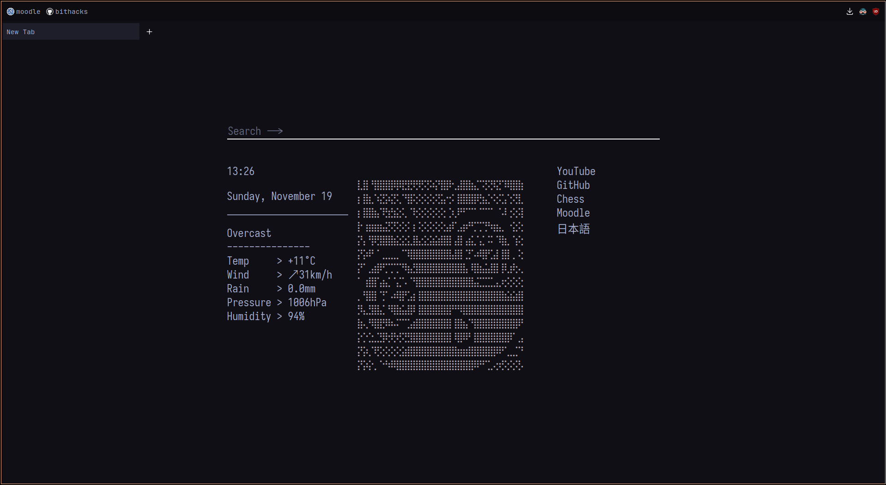

# [Hyprland] Smile

A simple, cohesive, Hyprland rice, using the [horizon](https://horizontheme.netlify.app/) colourscheme.

* WM        --> [Hyprland](https://hyprland.org)
* Terminal  --> [Foot](https://gitlab.com/dnkl/foot/)
* Bar       --> [Waybar](https://github.com/alexays/waybar)

## Contents

* [Installation](#installation)
  * [Setup Firefox / Librewolf](./librewolf/)
* [Showcase](#Showcase)

# Installation

I'm using [paru](https://github.com/morganmilo/paru) as my AUR helper, make sure to change that to your package manager if required.
```bash
# Install required packages
paru -S hyprland foot waybar mako wbg fcitx5

git clone https://github.com/TheGogy/dotfiles
```

You can then copy the files from `.config` to your config directory. Make sure to make any backups if required.

```bash
mv dotfiles/.config/ ~
```

Some files in the config (specifically [hyprland.conf](./.config/hypr/hyprland.conf) require the specific wallpaper to be in `~/wallpapers/`. You can copy the entire folder over, or just the wallpaper you want.

```bash
mv dotfiles/wallpapers ~/wallpapers/
```

To get the startpage for firefox / librewolf, look [here](./librewolf/).

# Showcase



