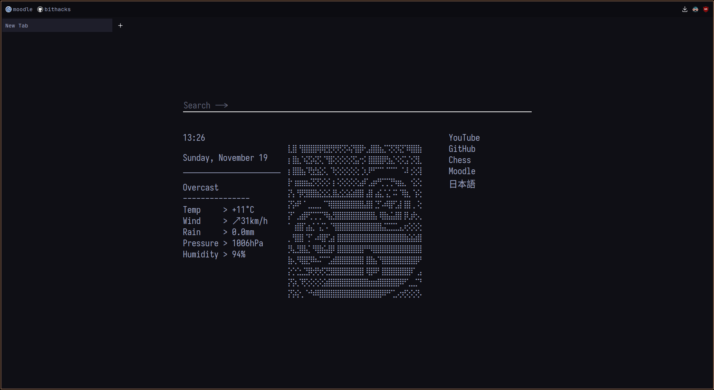

# Librewolf setup

> [!NOTE]
> The following setup is for librewolf. This should work fine for firefox, just make sure that all the paths are correct.



## Startpage

`startpage/` is for the firefox/librewolf new tab.

To install:

1. set the city to your desired location (for weather) in `./startpage/minimal/weather.js`

2. Copy the entire `startpage/` directory to `~/.librewolf/`

3. Add the following code to the top of the file `/usr/lib/librewolf/librewolf.cfg` to load the page when you open a new tab:
```js
var {classes:Cc,interfaces:Ci,utils:Cu} = Components;

/* set new tab page */
try {
  Cu.import("resource:///modules/AboutNewTab.jsm");
  var newTabURL = "file:///home/<user>/.librewolf/startpage/minimal/index.html"; // Custom homepage location
  AboutNewTab.newTabURL = newTabURL;
} catch(e){Cu.reportError(e);} // report errors in the Browser Console
```


## Userchrome

1. Put the `chrome/` directory into your profile folder (`~/.librewolf/#########.default/`)

2. Go to [about:config](about:config) and set the following flag:
```
toolkit.legacyUserProfileCustomizations.stylesheets = true
```
3. Restart librewolf!


## Kanagawa theme for Dark Reader

1. Install [dark reader](https://addons.mozilla.org/en-US/firefox/addon/darkreader/) for firefox 

2. Go to `See All Options` > `Colors` and set the following colours:

| Option     | Color     |
|------------|-----------|
| Background | `#1f1f28` |
| text       | `#dcd7ba` |
| scrollbar  | `#fab387` |
| selection  | `#585b70` |
